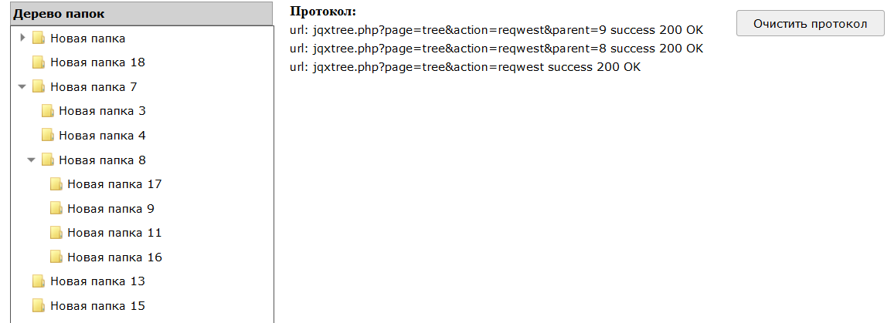

# jqxTree
An example of using js widgets jQWidgets. Exchange with the server is implemented using AJAX technology. The server part is written in PHP according to the MVC scheme.

Пример использования js виджетов фреймворка jQWidgets. Обмен с сервером реализован по технологии AJAX. Серверная часть написана на PHP по схеме MVC.



## Описание

В приложении Front-end реализован с использования js виджетов фреймворка [jQWidgets](https://www.jqwidgets.com).
Дерево папок основано на [jqxTree](https://www.jqwidgets.com/jquery-widgets-demo/demos/jqxtree/).
Также в приложении использованы: [jqxExpander](https://www.jqwidgets.com/jquery-widgets-demo/demos/jqxexpander/index.htm), [jqxWindow](https://www.jqwidgets.com/jquery-widgets-demo/demos/jqxwindow/index.htm#demos/jqxwindow/defaultfunctionality.htm), [jqxMenu](https://www.jqwidgets.com/jquery-widgets-demo/demos/jqxmenu/index.htm).

Back-end реализован на PHP по схеме MVC.
Содержимое папок по мере их открытия подгружается по технологии AJAX из БД MySQL или MSSQL (настраивается в файле `params.php`).
Папки можно создавать, удалять, переименовывать, перетаскивать мышкой. Меню вызывается по правой кнопке. 
Результаты манипуляций данными сохраняются в БД.

## Установка

```
composer create-project sergechurkin/jqxTree path "1.1.x-dev"
```
Приложение зарегистрировано на
[packagist](https://packagist.org/packages/sergechurkin/jqxTree).

[Запустить программу.]( http://sergechurkin.vacau.com/jqxtree.php)
